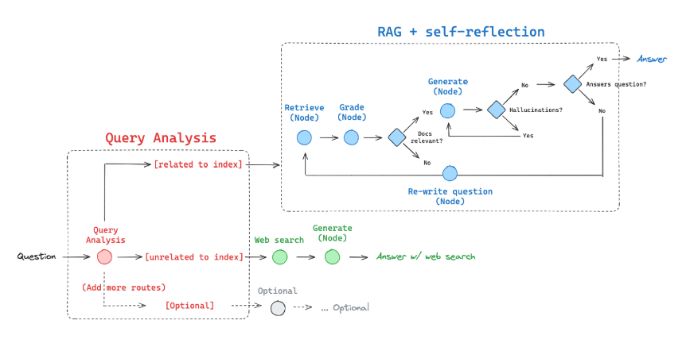

# LangChain Q&A Bot

## Project Overview
LangChain Q&A Bot is a chatbot designed to answer any questions related to LangChain.
The general approach involved building an **adaptive Retrieval-Augmented Generation (RAG)** system using the following technologies:

- **LangGraph** – To control the workflow and decision-making logic  
- **Pinecone** – As a vector database for efficient retrieval  
- **OpenAI (GPT-4o)** – As the chat model for generating responses  
- **OpenAI Embeddings** – To convert text into vectors and store them in Pinecone  
- **Streamlit** – To design the web interface and deploy on Streamlit Cloud  

## Features
- Intelligent and context-aware responses to LangChain-related queries
- Efficient retrieval of relevant information using vector search
- Interactive web-based chatbot interface

## Why Use Adaptive RAG?
Adaptive RAG is an innovative strategy for Retrieval-Augmented Generation (RAG) that combines query analysis with active and self-corrective RAG techniques. This approach aims to optimize the retrieval and generation process by dynamically adapting to the nature of the query.

## Enhancements & Future Improvements
To further improve the chatbot's performance and domain-specific accuracy, the following enhancements are planned:

### Fine-Tuning
- **Dataset Generation** – Use **ChatGPT** to generate high-quality datasets for fine-tuning.  
- **Fine-Tuning with Unsloth** – Leverage **Unsloth** for efficient model fine-tuning on domain-specific data.

